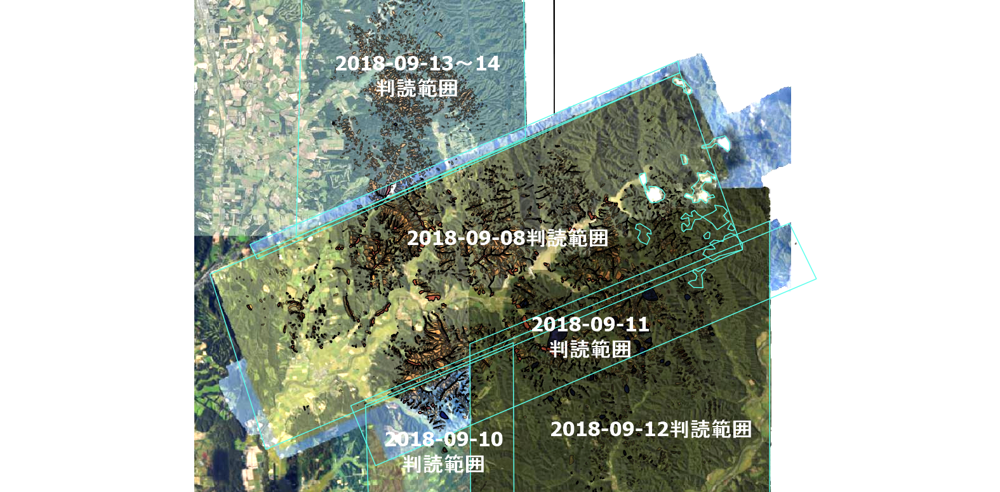

# 2018年9月6日発生　北海道胆振東部地震 正射画像のトレース

## トレースした地図について

ここで公開している地図データは、平成30年（2018）北海道胆振東部地震で発生した厚真町での山腹崩壊を、地理院地図の航空写真からQGISでトレースしたものです。
次の点に注意してください。

- すべての崩壊地についてトレースされているとは限りません。樹木に隠れているものや、雲に隠れているもの、地理院地図の範囲外のものはトレースされていません。また、見逃しているものもあるかもしれません。
- トレースした崩壊地の形は、崩壊地の厳密な形と同じではありません。また、崩壊地が拡大、回復して、実際とは範囲が違う場合があります。トレースした形はトレースした人の感性によります。
- 崩壊地は地震で発生した崩壊地では無く、もともとあった崩壊地の場合もあります。

## 利用にあたって

トレースした崩壊地地図を、研究、書籍、ホームページ、SNSで使う場合には、出典を明示してください。 
　出典の書き方は、次のとおりです。  
「この地図は地理院地図　平成30年北海道胆振東部地震 正射画像をトレースした地図ですhttps://github.com/koukita/2018_09_06_atumatyou」
出典と明示することで、自由に利用することができます。 
詳細は[国土地理院コンテンツ利用規約](http://www.gsi.go.jp/kikakuchousei/kikakuchousei40182.html) を参照してください。
 
 
　この地図の利用は、利用者自身が責任を持ってください。利用者が行う一切の行為（編集・加工等した情報を利用することを含む。）について、公開者は何ら責任を負うものではありません。

## 出典
国土地理院地理院地図 
平成30年北海道胆振東部地震 厚真川地区 正射画像（2018年9月6日撮影） 
平成30年北海道胆振東部地震 厚真地区 正射画像（2018年9月6,8日撮影） 
平成30年北海道胆振東部地震 厚真東部地区 正射画像（2018年9月11日撮影） 

## シェープファイル

QGISなどのGISで利用できます。  
座標系は、「JGD2000（緯度経度）EPSG:4612」です。 
「厚真町堆積土トレース.shp」の「土砂ダム」フィールドは、土砂ダムとなっている堆積土の場合は「１」を入力しています。

## GeoJson

ポリゴンのGeojsonファイルです。 
Web地図などにお使いください。 
座標系は、「JGD2000（緯度経度）EPSG:4612」です。

## KML
KMLファイルは、GoogleEarthで利用できます。

## GARMINフォルダ

GARMINフォルダに保存されているIMGファイルをGARMINのハンディGPSにコピーすることで、崩壊地をGPSに表示することができます。ただし、最新版の場合には、外部IMGファイルの表示を許可していないものもありますので、利用にはGPSの機能を確認してください。個別の使用方法の質問には答えられません。

## Geopaparazziフォルダ

Androidの地図アプリ「Geopaparazzi」用のファイルが保存されています。 
### ＜厚真町崩壊地.sqliteの使い方＞
1. Androidスマートフォンの内蔵ストレージのMapsフォルダに、厚真町崩壊地.sqliteを保存します。
2. Geopaparazziを起動して、地図画面を開き、右上のメニューボタンをタップし、「Spatialiteデータリスト」を選択します。
3. 右下の「＋」ボタンをタップして、ファイルの追加をタップし、コピーした厚真町崩壊地.sqliteを選択します。
4. 図形が無いというエラーが表示されたら、初期メニューに戻り、右上のメニュー→設定→Spatialite設定→Spatialite復元モードにチェックを付けます。
5. 再び初期メニューに戻り、右上のメニュー→終了でアプリを終了します。
6. タスクに残っている場合があるので、タスクにあるGeopaparazziも終了します。
7. 再度、Geopaparazziを起動し直して、2.～3.をもう一度行います。レイヤが追加されればOKです。
8. レイヤのメニューをタップし、「Propeties」で塗りつぶしの色や透明度を設定できます。

### ＜平成30年北海道胆振東部地震厚真川地区正射画像_国土地理院.mbtilesの使い方＞

厚真町の空中写真をGeopaparazziの背景画像として、使うことができます。携帯電波圏外のオフラインでも利用できます。 
このMbtilesはファイル容量の関係でズームレベル17までで作成しています。 
解像度的には問題ないと思いますが、ズームレベル17では小さいという場合は、地図画面のズームの「＋」ボタンをロングタップすることで、地図を拡大できます。

1. Mbtilesファイルをスマートフォンの内蔵ストレージの任意のフォルダに保存します。（SDカードは使えません）
2. 初期メニューの右上のレイヤボタンをタップします。
3. 右下の「＋」ボタンをタップして、ファイルを選択して、コピーしたMbtilesファイルを選択します。
4. 初期メニューのマップボタンをタップします。
5. 背景地図に空中写真が表示されます。
6. 位置がわからない場合には、地図画面でメニューボタンをタップして、「背景マップの中心へ」を選択します。
 

## 更新履歴
2018-09-08　崩壊地シェープファイル等を公開 
2018-09-09　堆積土のデータを追加、崩壊地データを少し修正 
2018-09-10　地理院地図（平成30年北海道胆振東部地震 厚真地区 正射画像（2018年9月6,8日撮影））の崩壊地トレースを追加した。 
2018-09-11　厚真川地区南側を追加した。 
2018-09-12　厚真東部地区を追加した。 

